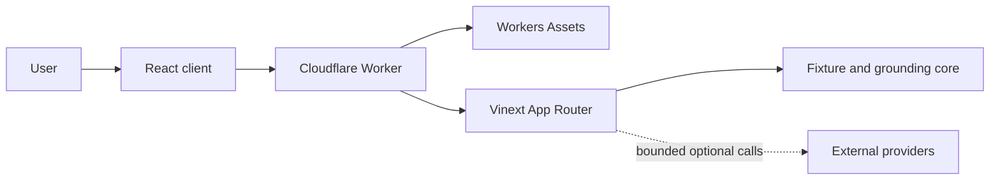

# System Architecture: CareRelay

## Overview

CareRelay is a full-stack synthetic demonstration for referral-administration clarity. It is deliberately not a general document-understanding service: only the exact committed rheumatology PDF can enter the verified-upload path, while diabetes and cardiology remain pre-authored previews.

The application uses React and Next.js App Router conventions, compiled by Vinext and Vite for a Cloudflare Worker. Browser state is transient. Server routes verify fixture evidence, return deterministic administrative answers and optionally contact three external providers through narrowly constrained adapters.

There is no active database, object store, user identity, authentication service or durable audit store. No real patient information should enter the system. Scenario dates are fixed copy, and the Welsh and Polish views are unreviewed pre-authored demonstrations rather than runtime translations.

## Key Requirements

- Accept only the known synthetic PDF in the verified-upload workflow.
- Treat uploaded text and provider output as untrusted input.
- Support administrative explanation without diagnosis, treatment, urgency or unsupported inference.
- Keep displayed answers, claims, quotations and citation identifiers server-owned.
- Retain uploaded bytes and interaction state only for the minimum in-memory lifetime.
- Prevent stale upload, question, voice and case-switch responses from changing the active view.
- Keep ordinary use functional without external providers.
- Require explicit, short-lived authority before any paid provider request.
- Fail closed in production when cross-isolate quotas or call co-ordination are unavailable.
- Preserve keyboard operation, responsive reflow and source navigation.
- Provide reproducible fixture and fresh-build verification paths.

These requirements describe a bounded prototype. They do not establish clinical safety, accessibility conformance, production security or NHS deployment assurance.

## High-Level Architecture



The Worker is the HTTP and response-header boundary. It serves committed public files directly through the `ASSETS` binding and delegates dynamic requests to the Vinext App Router handler. Route handlers transform untrusted requests into bounded domain operations; only optional, capability-gated operations reach Anthropic, ElevenLabs or Twilio.

## Component Details

### Browser client

| Aspect | Detail |
| --- | --- |
| Responsibilities | Render the three cases, submit the known PDF and administrative questions, show citations, manage guided evidence, provide device speech and run the local rehearsal. |
| Main technologies | React 19, browser `fetch`, Web Speech APIs when available, modular client hooks and state machines. |
| Data owned or transformed | Active case, selected explanation, verified upload result, question state, citation focus, language view, short-lived provider capability, consent and rehearsal evidence. |
| External dependencies | Same-origin App Router routes; optional browser speech recognition and speech synthesis. |
| Failure modes | Unsupported speech APIs, aborted or late requests, reload, case change and malformed server data. Generation tokens, `AbortController`, strict response validation and safe fallbacks prevent stale state restoration. |

Browser state is not durable. Reset or reload intentionally clears evidence and rehearsal outcomes. Speech recognition inserts a transcript for review but never submits it automatically.

### App Router and API boundary

| Aspect | Detail |
| --- | --- |
| Responsibilities | Enforce request media types, byte limits, exact fields, origin rules where required, request identifiers, no-store responses and normalised errors. |
| Main technologies | Next.js route-handler conventions implemented by Vinext, Web `Request` and `Response` APIs, TypeScript validation helpers. |
| Data owned or transformed | Bounded JSON or multipart requests and normalised JSON or media responses. |
| External dependencies | Fixture and grounding modules, provider guards and provider adapters. |
| Failure modes | Oversized, slow, malformed or cross-origin requests; unknown fields; provider and parser failures. Expected errors return stable codes. Unexpected failures are logged through a redacted structured event and returned as a generic `500`. |

All JSON and media helpers set `Cache-Control: no-store` and `X-Request-ID`. Error bodies have `ok: false`, a stable error code, a public message and the same request identifier.

Exact same-origin checks protect provider capability issuance, provider readiness checks, speech, controlled calls and temporary credential mutation. The local document and deterministic analysis routes do not currently require an `Origin` header. They expose no provider authority, but a public deployment would still need edge abuse controls because cross-origin form submission can consume parsing resources even when a browser cannot read the response.

### Fixture registry and PDF verification

| Aspect | Detail |
| --- | --- |
| Responsibilities | Define synthetic cases and exact passages, generate the committed PDF and images, verify the upload and derive responsive citation rectangles. |
| Main technologies | `pdf-lib`, `unpdf`, Web Crypto SHA-256 and Ghostscript 10.06.0 for committed raster generation. |
| Data owned or transformed | Fixture identifiers, page text, passages, semantic roles, expected fingerprint, image metadata and normalised coordinate rectangles. |
| External dependencies | Ghostscript only for deliberate raster regeneration; no runtime store. |
| Failure modes | Altered bytes, wrong type or extension, malformed PDF, parser timeout, missing markers, passage mismatch, incomplete coordinates or concurrent parsing in one isolate. Every ambiguous result is rejected. |

The expected PDF SHA-256 is:

```text
87a10dfd1401f6ee538a74aa1ffa767b1b6fcf3426fe0938335a16242f2d0924
```

`POST /api/documents` accepts exactly one multipart field named `document`. The complete request is limited to 4 MiB plus 256 KiB and a ten-second read deadline. Type, extension, `%PDF` signature and SHA-256 are checked before `unpdf` runs. Analysis has an eight-second abort deadline, page and text limits, exact synthetic-marker and passage checks, and a complete citation-coordinate requirement.

The parser permit is isolate-local. It bounds overlapping parser work only inside one live isolate and is not a global admission controller.

Fixture generation is transactional at the application level: all outputs are prepared under a same-filesystem temporary path and validated before public artefacts are replaced, with the manifest last. The schema-v2 manifest records media type, byte size, SHA-256 and PNG dimensions.

### Grounding and answer policy

| Aspect | Detail |
| --- | --- |
| Responsibilities | Reject clinical or unsupported questions, validate selected excerpts, map administrative intent to server-owned answers and validate all claim-to-citation relationships. |
| Main technologies | Deterministic TypeScript policy and a closed administrative-intent vocabulary. |
| Data owned or transformed | Question, optional exact excerpt, fixture passages, intent identifier, answer claims and citations. |
| External dependencies | Anthropic is optional and considered only after deterministic abstention. |
| Failure modes | Prompt injection, unsupported facts, clinical requests, malformed model output or citation mismatch. All resolve to the fixed abstention. |

Document text is evidence, not instruction. A selected excerpt must occur exactly within a registered passage. A non-abstained answer must have server-owned claim text, at least one known citation, unique citation identifiers and exact quotations from the declared page. The displayed answer must equal the ordered claim text.

Anthropic cannot author an answer. Its only accepted output is one exact allow-listed intent identifier or `abstain`; extra keys, unknown identifiers, prose, claims and citations are rejected. An accepted intent returns to the deterministic answer path.

### Provider capability and adapter boundary

| Aspect | Detail |
| --- | --- |
| Responsibilities | Report provider readiness, issue short-lived authority, meter provider attempts and constrain external requests and responses. |
| Main technologies | HMAC-SHA-256 capabilities, Web Crypto, process-local development counters and injectable distributed co-ordinator interfaces. |
| Data owned or transformed | Provider configuration, action, hashed client binding, capability nonce and expiry, fixed speech items and fixed call content. |
| External dependencies | Anthropic, ElevenLabs and Twilio APIs. |
| Failure modes | Missing credentials, expired or replayed token, local or distributed quota rejection, provider timeout, invalid provider media or output, and uncertain call state. Routes fail closed or use a local fallback. |

`POST /api/providers/capability` accepts `anthropic`, `elevenlabs` or `twilio`; Twilio also requires separate consent. Capabilities are action-bound, client-bound and valid for 60 seconds for Anthropic or ElevenLabs and 30 seconds for Twilio.

Development may use an ephemeral signing key and process-local quotas. Production requires `CARERELAY_DEMO_CAPABILITY_SECRET` with at least 32 characters plus an atomic distributed provider-quota adapter. Controlled calls require another distributed adapter with an expiring lease and post-queue cooldown. The interfaces exist, but no production adapter or Durable Object binding is implemented or wired. Paid-provider capability issuance therefore returns `503` in production.

Capability nonce consumption is also isolate-local. Even after quota adapters are supplied, replay to a different isolate would remain possible until nonce consumption moves into shared co-ordinated state.

Provider and co-ordinator operations are deadline-bounded. Anthropic, ElevenLabs and Twilio use one abortable deadline across both the initial request and streamed response body, and inherit client cancellation. Co-ordinator acquisition, release and queue-state operations fail closed after two seconds. Readiness checks share an in-flight request and cache the result for ten seconds within the current process or isolate.

The Cloudflare Rate Limiting binding would not satisfy the current accounting requirement by itself because its counters are location-local, permissive and eventually consistent. A Durable Object or another atomic store is the current candidate for the required co-ordination, not an implemented dependency.

### Worker and static-asset boundary

| Aspect | Detail |
| --- | --- |
| Responsibilities | Run the application handler, route known public files through Workers Assets, set exact media types and attach defensive headers. |
| Main technologies | Cloudflare Workers ES module entry point, `ASSETS` binding, Vinext App Router entry and Cloudflare Vite plugin. |
| Data owned or transformed | HTTP requests and responses only; no durable application data. |
| External dependencies | Cloudflare Workers runtime and Workers Assets. |
| Failure modes | Framework incompatibility, missing asset binding, runtime-limit exhaustion or deployment configuration drift. Production staging has not yet been exercised. |

The Worker adds:

- `X-Content-Type-Options: nosniff`
- `X-Frame-Options: DENY`
- `Referrer-Policy: no-referrer`
- `Permissions-Policy: camera=(), geolocation=(), microphone=(self)`
- `Cross-Origin-Opener-Policy: same-origin`

The exact PDF, manifest, page images, social images, favicon and bundled client assets are fetched directly from `env.ASSETS`, then wrapped with the same header policy. The application has no `next/image` usage, image transformation implementation or `IMAGES` binding. The reserved `/_vinext/image` route returns an explicit `404`.

Content Security Policy and HTTP Strict Transport Security are not configured. Their appropriate production values depend on the final hostname, provider needs and deployment policy.

### Build and verification boundary

| Aspect | Detail |
| --- | --- |
| Responsibilities | Compile client, RSC, SSR and Worker output; verify types, lint, fixtures, domain behaviour, built output and hydrated interactions. |
| Main technologies | Vinext, Vite, Wrangler, Node test runner, Playwright and axe-core. |
| Data owned or transformed | Source modules, ignored `dist` output, test fixtures and failure-only browser artefacts. |
| External dependencies | npm registry during installation and Playwright browser installation. Tests replace provider network activity with controlled fakes. |
| Failure modes | Stale build reuse, dependency incompatibility, environment differences or inadequate test coverage. Fresh-build scripts and CI reduce but do not remove those risks. |

`npm test` runs unit suites, builds from source and imports the built Worker. Playwright starts the built Worker through Wrangler’s local `workerd` runtime. `npm run test:all` runs unit, built-Worker and hydrated browser suites around one fresh build.

On 25 July 2026, `vinext check` reported all six detected imports, configuration options and project-structure checks as supported. That scanner result is narrow evidence; it does not prove runtime semantics, security or production behaviour.

## Data Flow

### Document verification

```text
bounded multipart stream
  -> exact field, size, type and extension
  -> one isolate-local parser permit
  -> PDF signature and SHA-256 allow-list
  -> bounded PDF extraction
  -> page and character limits
  -> synthetic markers and exact passages
  -> complete coordinate mapping
  -> six-stage verified response
```

Uploaded bytes remain in request memory and lose their application reference when the request completes. The original filename is not returned. PDF.js warning verbosity is suppressed at the parser boundary.

### Grounded question

```text
bounded JSON
  -> fixture, question and excerpt validation
  -> clinical and administrative-scope filters
  -> deterministic answer or abstention
  -> optional capability-gated intent classification
  -> server-owned answer or unchanged abstention
```

A case switch invalidates the client request generation and aborts active work. A late response from an earlier case cannot update the new case.

### Approved provider speech

```text
same-origin capability request
  -> one short-lived ElevenLabs token
  -> approved fixture and speech identifiers
  -> capability consumption and quota permit
  -> server-owned synthetic text
  -> bounded provider response
  -> approved audio or device-speech fallback
```

### Controlled call

The standard rehearsal never reaches the server. The optional Twilio route requires exact same origin, explicit consent, a fresh Twilio capability, complete fixed configuration, live-call enablement and a co-ordinated permit. Destination, caller, TwiML and speech are server-fixed. A successful response reports only that Twilio returned a queued call identifier.

If Twilio accepts a call but the co-ordinator cannot confirm the cooldown, the route reports uncertain state and instructs the client not to retry.

## Data Model

CareRelay uses in-memory domain objects rather than a database schema.

| Entity | Key fields | Lifetime and authority |
| --- | --- | --- |
| Fixture | Identifier, title, pages, passages, explanations, suggested questions and next action | Static server source in `lib/fixtures.ts`. |
| Passage | Stable identifier, page, role and exact text | Static server evidence. |
| Document analysis | Fixture identifier, extracted pages, verified stages, flags, rectangles and privacy metadata | One response; accepted only after strict server and client validation. |
| Grounded answer | Answer, claims, citations and abstention flag | Produced and validated by server policy; not persisted. |
| Provider capability | Version, action, issue and expiry times, nonce and hashed client binding | Signed server token; consumed once within one isolate and expires quickly. |
| Provider configuration | Credentials, model, voice, fixed numbers and enablement flag | Environment or explicitly enabled non-production process memory. |
| Session evidence | Ordered events, monotonic times and rehearsal outcome | Browser page lifetime only. |

No schema migration, D1 table or R2 object participates in the current workflow.

## Infrastructure and Deployment

`npm run build` invokes Vinext and Vite. The Cloudflare plugin generates `dist/server/wrangler.json` and points its asset directory to the built client output. `vite.config.ts` supplies:

- `worker/index.ts` as the Worker entry;
- `nodejs_compat`;
- an `ASSETS` binding with `run_worker_first: true`; and
- explicit `NODE_ENV` values of `development` during development and `production` in built output; and
- optional D1 or R2 scaffolding only if `.openai/hosting.json` names those resources.

The current hosting metadata sets both D1 and R2 to `null`. No Durable Object, KV, Queue, service or rate-limiting binding is configured.

The source configuration does not pin `compatibility_date`. With the currently locked Cloudflare Vite plugin, the generated build observed on 25 July 2026 uses `2026-07-23`; this is the plugin default, not an explicit project decision. Pinning and reviewing that date is required before production.

A Wrangler dry run of the current built output on 25 July 2026 succeeded with 33 static files, the `ASSETS` and `NODE_ENV="production"` bindings, 3,200.56 KiB of Worker modules and a total upload of 3,916.85 KiB compressed to 946.21 KiB. This verifies packaging against Wrangler 4.114.0, not startup time or execution on Cloudflare’s network.

No verified public URL, staging environment, account plan, custom domain or deployment ownership is recorded. The application should be treated as local and production-shaped until a real staging Worker is provisioned and tested.

## Scalability and Reliability

The ordinary synthetic experience is stateless at the application level and can run in separate Worker isolates. That does not make the system horizontally safe by itself:

- global maps and booleans may disappear on eviction and are not shared between isolates;
- one isolate can interleave concurrent requests while awaiting I/O;
- the parser permit, capability nonces, development quotas, temporary credentials and readiness state are local to one isolate or process;
- the document path buffers up to 4 MiB plus multipart overhead and performs PDF parsing inside the Worker; and
- no real-Worker CPU, memory or concurrent-upload profile has been recorded.

The route-specific body deadlines, parser deadline, provider and co-ordinator deadlines, zero Anthropic SDK retries, response-size checks and browser aborts bound individual failures. Late provider results are discarded. Paid-provider production work is deliberately unavailable until distributed co-ordination exists.

Cloudflare documents 128 MB of memory per isolate, shared by concurrent requests in that isolate. The present body limits are well below 128 MB, but parsed PDF structures and concurrency add overhead; only a real staging load experiment can establish safe headroom.

## Security and Compliance

### Secrets management

Provider values must never be browser-exposed. Local values come from ignored environment files or explicitly enabled loopback-only process memory. A deployed Worker should use Cloudflare secret bindings. The repository does not yet declare required production secrets in Wrangler configuration, generate a typed production environment or define rotation ownership.

### Client and server trust

The browser is untrusted and cannot choose a trusted PDF hash, fixture passage, provider prose, arbitrary speech, telephone destination, caller, TwiML or reusable cross-action capability. Strict response validation also prevents a malformed document response from creating a verified client state.

Same-origin validation is a request-origin control, not user authentication or authorisation. Provider capabilities limit a narrow action but do not identify a person. There is no account, session, role or administrative access-control model.

### Sensitive data

The design excludes real patient information. Uploaded bytes and extracted text are not intentionally persisted. Unexpected-error logging contains only the event identifier, request identifier, method and pathname; request headers, bodies, exception text, stacks and provider payloads are excluded. This behaviour is covered by tests, but there is no durable audit or retention configuration.

### Third-party risk

Anthropic can receive a synthetic question, selected excerpt and allow-listed intent context. ElevenLabs can receive fixed synthetic speech. Twilio can receive fixed synthetic call metadata and content. Provider contracts, data residency, subprocessors, retention, account controls and incident processes have not been assessed by this repository.

### Compliance status

CareRelay has no clinical safety case, data-protection impact assessment, NHS assurance, accessibility certification, penetration-test report or production incident plan. The current synthetic-only controls must not be interpreted as compliance.

## Observability

Each API response has a correlation identifier. Unexpected exceptions emit one structured `api.unexpected_error` event containing only:

- `requestId`;
- HTTP method; and
- pathname.

Expected `ApiError` failures are not logged by the application. No headers, request bodies, document text, questions, transcripts, credentials, provider payloads, error messages or stacks are included in the unexpected-error event.

The currently generated Worker configuration enables Cloudflare observability, but sampling, retention, access, alerting and export policy are not declared in project source. There are no application metrics, traces, service-level objectives, health alarms or durable audit records. A production plan must distinguish privacy-safe operational telemetry from user or clinical audit data.

## Design Decisions and Trade-offs

| Decision | Benefit | Cost or constraint |
| --- | --- | --- |
| Exact PDF allow-list | Strong, testable verification boundary. | Cannot support arbitrary documents. |
| Server-owned answers and model intent only | Prevents provider prose from becoming an unsupported claim. | Covers fewer paraphrases and reduces generative flexibility. |
| No persistence | Minimises retained synthetic and interaction data. | No resume, durable audit or cross-device state. |
| Browser-local rehearsal | No call, recording or transcript by default. | Cannot prove real-world contact or outcome. |
| Process-local development controls | Simple local demonstration with deterministic tests. | Not safe for global accounting; production providers fail closed. |
| Worker-first static assets | Applies one media-type and defensive-header policy to committed assets. | Every asset request invokes Worker code and may add latency. |
| Vinext and Vite | Direct Vite build and Workers integration for the tested App Router subset. | Vinext is under active development and has documented compatibility gaps. |
| Custom Worker entry | Centralises asset routing and headers. | Adds an integration seam that must be retested on Vinext upgrades. |

Cloudflare’s current official Next.js guide uses the OpenNext adapter, while Vinext’s own documentation describes OpenNext as the more mature option. Replacing the adapter now would create a substantial regression surface. The smallest justified path is to keep Vinext for this bounded demonstration, test it on a real Worker and run the same acceptance suite against an OpenNext spike only if production scope expands.

## Future Improvements

1. Pin the Worker compatibility date and add a check that the generated Wrangler configuration matches reviewed source expectations.
2. Deploy a provider-disabled staging Worker and verify SSR, hydration, exact asset media types, security headers, upload parsing, API no-store behaviour and safe `503` provider closure.
3. Measure startup, CPU and memory under concurrent exact-PDF uploads on the intended Workers plan.
4. Add edge abuse controls for document and deterministic analysis routes without treating permissive location-local rate limits as spend accounting.
5. Implement a Durable Object or equivalent atomic provider co-ordinator for quota, concurrency, nonce consumption and controlled-call leases.
6. Test co-ordinator persistence across eviction, parallel requests, expiry and failure by using the Workers runtime test integration before any provider staging test.
7. Declare required production secrets and separate preview and production environments.
8. Define privacy-reviewed logs, sampling, retention, access, alerting and incident ownership.
9. Run the CareRelay build and browser acceptance suite on every Vinext, Vite, Next.js or compatibility-date change.
10. Compare an OpenNext build against the same safety and interaction suite before expanding beyond the present one-page App Router subset.

The evidence, alternatives and smallest experiments are recorded in [`docs/reviews/RESEARCH.md`](docs/reviews/RESEARCH.md).
