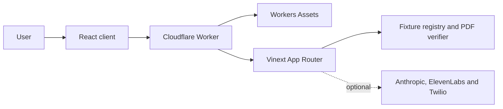

# CareRelay

A bounded synthetic demonstration for understanding referral administration, checking answers against source passages and rehearsing a next step.

## Description

CareRelay presents fictional referral letters in clearer language and links every supported answer to exact evidence in the source. Only the bundled two-page synthetic rheumatology PDF can enter the verified-upload path. The diabetes and cardiology cases are pre-authored interface previews and cannot be verified by upload.

CareRelay is independent and is not affiliated with or endorsed by the NHS. It does not connect to NHS, GP, hospital or referral systems. It is not medical advice, emergency care, diagnosis, triage or treatment support. Do not upload real patient information.

All names, organisations, dates, references, telephone numbers and events are fictional. Scenario dates and phrases such as “due now” are fixed demonstration copy; they are not live deadlines. Welsh and Polish text is pre-authored, has not been professionally or clinically reviewed and continues to cite the English synthetic source.

## Table of Contents

- [Features](#features)
- [Tech Stack](#tech-stack)
- [Architecture Overview](#architecture-overview)
- [Installation](#installation)
- [Usage](#usage)
- [Configuration](#configuration)
- [Screenshots or Demo](#screenshots-or-demo)
- [API Reference](#api-reference)
- [Safety and Privacy Boundaries](#safety-and-privacy-boundaries)
- [Tests](#tests)
- [Quality Reports](#quality-reports)
- [Roadmap](#roadmap)
- [Contributing](#contributing)
- [Licence](#licence)
- [Contact or Support](#contact-or-support)

## Features

- Exact SHA-256, PDF structure, marker, passage and citation-coordinate verification for one committed synthetic PDF.
- Server-owned administrative answers with exact source quotations and safe abstention for unsupported or clinical questions.
- Plain and detailed English explanations plus pre-authored Welsh and Polish demonstration views.
- Browser-only guided evidence tracking and a four-step simulated call rehearsal.
- Keyboard-operable case and page controls, focus management, reduced-motion handling and responsive reflow.
- Optional Anthropic intent classification, approved ElevenLabs speech and a tightly controlled Twilio test-call route.
- Short-lived, action-bound provider capabilities and production fail-closed co-ordination interfaces.
- Deterministic fixture generation, Worker-level tests and hydrated Chromium accessibility and interaction tests.

## Tech Stack

| Area | Verified implementation |
| --- | --- |
| Interface | React 19.2.8, React DOM 19.2.8 and Next.js 16.2.11 App Router conventions |
| Build and runtime adapter | Vinext 0.0.50, Vite 8.1.5 and Cloudflare Vite plugin 1.47.0 |
| Deployment runtime | Cloudflare Worker with Workers Assets routed through the Worker |
| PDF generation and parsing | `pdf-lib` 1.17.1 and `unpdf` 1.8.0 |
| Optional providers | Anthropic SDK 0.115.0, ElevenLabs HTTP API and Twilio HTTP API |
| Verification | Node test runner with `tsx`, Playwright 1.62.0 and axe-core 4.12.1 |
| Language and tooling | TypeScript 5.9.3, ESLint 9.39.4 and Wrangler 4.114.0 |

The lockfile is the authority for the installed dependency graph. Vinext is under active development and is not treated here as a universal or proven replacement for every Next.js production workload. See [the architecture document](ARCHITECTURE.md) and [the dated platform research](docs/reviews/RESEARCH.md).

## Architecture Overview



The browser keeps interface and rehearsal state in memory and sends bounded same-origin requests to the Worker. The Worker applies response headers, serves public assets and delegates dynamic requests to App Router route handlers. Those handlers use committed fixture data for verification and grounding; optional providers are outside the trust boundary and cannot author displayed facts.

There is no active database, D1 binding, object store, user account or authentication service. Production paid-provider requests remain unavailable until distributed co-ordination adapters are implemented and wired to the Worker.

## Installation

### Requirements

- Node.js 22.13.0 or later.
- npm.
- Chromium installed by Playwright only when running hydrated browser tests.
- Ghostscript 10.06.0 exactly, only when deliberately regenerating committed fixture PNGs.

### Set up and run

```bash
npm ci
cp .env.example .env.local
npm run dev
```

Open `http://localhost:3000`.

The empty provider values in `.env.example` are valid. Deterministic answers, the bundled explanation variants, device speech and local rehearsal work without external credentials.

## Usage

### Explore the synthetic cases

1. Open the rheumatology case to inspect its source-linked explanation.
2. Use diabetes and cardiology as preview-only interaction scenarios.
3. Ask administrative questions. Unsupported, clinical or uncertain questions return the fixed abstention instead of an inferred answer.
4. Open a citation to move to the relevant source page.
5. Use the rehearsal to complete all four simulated prompts in order. It never places a call.

### Verify the bundled PDF

Upload [`public/demo/rheumatology-referral-synthetic.pdf`](public/demo/rheumatology-referral-synthetic.pdf). Its expected SHA-256 is:

```text
87a10dfd1401f6ee538a74aa1ffa767b1b6fcf3426fe0938335a16242f2d0924
```

No other document is accepted. A successful response requires the exact fingerprint, both synthetic notices, the expected two-page text and a complete coordinate map for every registered passage.

### Regenerate an intentional fixture change

```bash
npm run generate:fixture
```

The generator writes the PDF, two page images, social card and schema-v2 manifest to same-filesystem staging paths, validates the complete set, then replaces public files with the manifest last. Committed raster generation requires Ghostscript 10.06.0 because renderer changes can alter PNG bytes.

Check all committed fixture artefacts without rewriting them or requiring Ghostscript:

```bash
npm run check:fixture
```

Treat a changed PDF fingerprint, passage or coordinate as safety-significant. Inspect the rendered pages and social card, update the expected fingerprint deliberately, review the manifest diff and rerun the fixture, upload and browser tests.

## Configuration

Copy `.env.example` to `.env.local` for local development. Add only the optional values required for the experiment being run.

| Variable | Purpose and boundary |
| --- | --- |
| `CARERELAY_PUBLIC_URL` | Fallback origin for generated metadata. Defaults to `http://localhost:3000`. |
| `ANTHROPIC_API_KEY` | Optional secret for bounded intent classification. |
| `ANTHROPIC_MODEL` | Optional model identifier; the code default is `claude-sonnet-5`. |
| `ELEVENLABS_API_KEY` | Optional secret for approved synthetic speech. |
| `ELEVENLABS_VOICE_ID` | Required with the ElevenLabs key before that provider is configured. |
| `ELEVENLABS_MODEL_ID` | Optional speech model identifier; the code default is `eleven_multilingual_v2`. |
| `TWILIO_ACCOUNT_SID` | Optional Twilio account identifier for the controlled test route. |
| `TWILIO_AUTH_TOKEN` | Optional Twilio secret. |
| `TWILIO_PHONE_NUMBER` | Fixed server-side caller number. |
| `TWILIO_ALLOWED_TO_NUMBER` | Fixed server-side destination; the browser cannot override it. |
| `CARERELAY_LIVE_CALLS_ENABLED` | Must equal `true` before the controlled call route can unlock. Defaults to false. |
| `CARERELAY_DEMO_CAPABILITY_SECRET` | HMAC secret for provider capabilities. Production requires at least 32 characters, but the missing distributed adapters still keep paid work closed. |
| `CARERELAY_RUNTIME_SECRET_ENTRY_ENABLED` | Set to `true` only for explicit non-production loopback credential entry. It is disabled by default. |

Never prefix provider credentials with `NEXT_PUBLIC_`. For a deployed Worker, use Cloudflare secret bindings rather than plaintext Wrangler variables. Required production secret declarations are not yet present in the repository.

### Provider capability boundary

Credentials and readiness do not authorise paid work. The browser must obtain a short-lived capability from `POST /api/providers/capability`, then send it once in `X-CareRelay-Capability`. Tokens are HMAC-signed, action-bound, tied to a hashed client context and valid for at most 60 seconds for Anthropic or ElevenLabs and 30 seconds for Twilio.

Nonce consumption, development quotas and development concurrency controls are isolate- or process-local. Production capability issuance fails closed without an atomic distributed provider-quota adapter. Controlled calls also require a separate distributed call adapter. Neither adapter is implemented or wired in this repository.

### Anthropic

Anthropic is considered only after the administrative filter accepts a question and deterministic grounding abstains. Claude may return one allow-listed intent identifier or `abstain`; prose, claims, citations, extra keys and unknown intents are rejected. The server maps an accepted intent to its own canonical answer and citations.

### ElevenLabs

The browser sends a fixture identifier and an approved speech identifier, not arbitrary text. The server resolves fixed synthetic text and validates the returned media type and byte size. Device speech remains the fallback.

### Twilio

The normal rehearsal is local. The optional call route additionally requires same-origin JSON, explicit consent, a fresh Twilio capability, all fixed server settings, the live-call flag and an available co-ordinated permit. The destination, caller, one-way TwiML and spoken content are server-fixed. A `202` response means only that Twilio reported the call as queued.

### Temporary local credentials

Temporary credential entry is available only when `CARERELAY_RUNTIME_SECRET_ENTRY_ENABLED=true`, the runtime is not production and host and origin unambiguously identify `localhost`, `127.0.0.1` or `[::1]`. Values remain in server-process memory, are never returned and disappear on restart. This is not a production secret manager.

## Screenshots or Demo

No live deployment URL or product screenshot is committed. Run the local demonstration as described above.

The repository includes a [social preview asset](public/care-relay-social-card.png) and the [two fixture page renders](public/demo/), but these are generated artefacts rather than evidence of a deployed service.

## API Reference

All JSON API responses use `Cache-Control: no-store` and include an `X-Request-ID`. Unexpected failures are normalised and produce one redacted structured event containing only the event name, request identifier, method and pathname. There is no durable audit sink or repository-defined retention policy.

| Method | Route | Purpose | Important conditions |
| --- | --- | --- | --- |
| `POST` | `/api/documents` | Verify the exact rheumatology PDF and return pages and coordinates. | One multipart field named `document`; bounded body and analysis deadlines. |
| `POST` | `/api/analyse` | Return a deterministic grounded answer or abstention, with optional intent classification. | Exact JSON fields; clinical and unsupported requests abstain. |
| `POST` | `/api/voice` | Generate an approved synthetic speech item. | Exact same origin, approved identifier, fresh ElevenLabs capability and permit. |
| `POST` | `/api/calls/mock` | Queue the fixed optional Twilio demonstration call. | Exact same origin, explicit consent, fresh Twilio capability and all server locks open. |
| `POST` | `/api/providers/capability` | Issue one short-lived provider capability. | Exact same origin; action-specific body of at most 512 bytes. |
| `GET` | `/api/providers/status` | Return non-secret configuration and readiness states. | Does not contact a provider. |
| `POST` | `/api/providers/check` | Run a bounded provider readiness check. | Exact same origin and one supported provider. |
| `GET`, `POST`, `PUT`, `DELETE` | `/api/settings/secrets` | Inspect status, replace or clear temporary local credentials. | Explicitly enabled, non-production and loopback only; values are never returned. |

`POST /api/documents` caps the complete multipart body at 4 MiB plus 256 KiB, applies a ten-second read deadline, verifies type, extension, signature and SHA-256 before parsing, then applies an eight-second analysis deadline. The parser permit is isolate-local and rejects overlapping analysis only within that isolate.

`POST /api/analyse` accepts `documentId`, a 2–1,000 character `question` and an optional exact 1–500 character `selectedText` excerpt. Every non-abstained answer is server-owned, supported by known passages and equal to its ordered claim text.

## Safety and Privacy Boundaries

- Uploaded bytes are buffered for one bounded request and are not written to application storage.
- PDF bytes, extracted text, questions, transcripts, outcomes and referral history are not persisted.
- Browser interaction evidence and rehearsal outcomes clear on reload or reset.
- The original upload filename is neither returned nor stored.
- PDF.js warning verbosity is suppressed so parser warnings do not emit uploaded text.
- Unexpected API failures log only an event name, request identifier, method and pathname. Headers, bodies, exception text, stacks and provider payloads are excluded.
- Platform invocation metadata may also exist when Worker observability is enabled; production sampling, retention and access policy are not configured here.
- There is no user identity, authentication, durable audit trail, clinical safety case, penetration-test result or compliance certification.
- Passing automated tests does not make the application suitable for real health information or care workflows.

## Tests

Run the standard local verification path:

```bash
npm run typecheck
npm run lint
npm run check:fixture
npm test
```

`npm test` runs the TypeScript behavioural suites, performs a fresh production build, then imports and exercises that newly built Worker. Provider tests use controlled fakes and do not require external credentials.

Install Chromium and run hydrated browser tests:

```bash
npx playwright install chromium
npm run test:browser
```

`npm run test:browser` performs a fresh build and starts the generated Worker through Wrangler’s local `workerd` runtime. `npm run test:all` runs unit tests, builds once, then runs built-Worker and browser suites. CI also performs type-checking, linting and complete fixture verification from a clean `npm ci`.

Coverage includes verification and grounding invariants, body limits and deadlines, provider guard behaviour, state-machine ordering, stale-request cancellation, citation navigation, keyboard focus, responsive reflow, public-asset media types and axe A/AA rules. These checks are not an accessibility certification, penetration test or clinical assurance.

## Quality Reports

- [Audit](docs/reviews/AUDIT.md)
- [Debug report](docs/reviews/DEBUG.md)
- [Error-handling review](docs/reviews/ERROR_HANDLING.md)
- [Design review](docs/reviews/DESIGN_REVIEW.md)
- [Build report](docs/reviews/BUILD_REPORT.md)
- [Technical review](docs/reviews/TECHNICAL_REVIEW.md)
- [Research](docs/reviews/RESEARCH.md)

## Roadmap

There is no committed release schedule. The current production-readiness gaps, in priority order, are:

1. Pin and review the Worker compatibility date, then run the provider-disabled synthetic path on a real staging Worker.
2. Implement and test distributed provider quota, nonce and controlled-call lease co-ordination before enabling any paid provider in production.
3. Declare required Worker secrets and add privacy-reviewed observability, sampling and alerting.
4. Reassess Vinext compatibility on every upgrade and compare the same CareRelay acceptance suite against OpenNext before broadening the product.
5. Complete manual keyboard, zoom, high-contrast and screen-reader testing.

See [the research record](docs/reviews/RESEARCH.md) for evidence and the smallest proposed experiments.

## Contributing

A repository contribution policy and public issue tracker have not been specified: `<ADD CONTRIBUTION PROCESS>`.

Before submitting any change, run:

```bash
npm run typecheck
npm run lint
npm run check:fixture
npm run test:all
```

Do not broaden accepted documents, enable public live calling, alter fixture evidence or connect a real healthcare system without separate product, privacy, clinical safety, security and operational review.

## Licence

`<ADD LICENSE>`

No repository licence has been identified. Do not assume permission to copy, modify or redistribute the project until a licence is added.

## Contact or Support

`<ADD SUPPORT CHANNEL>`

No verified maintainer contact or support channel is present in the repository.
